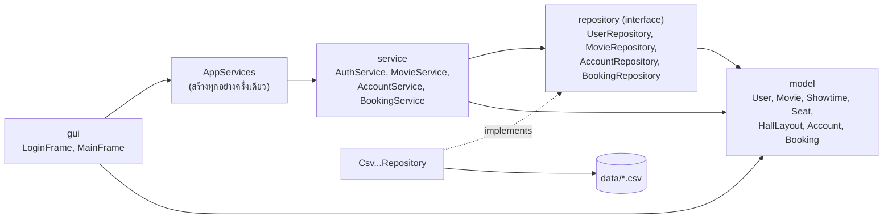
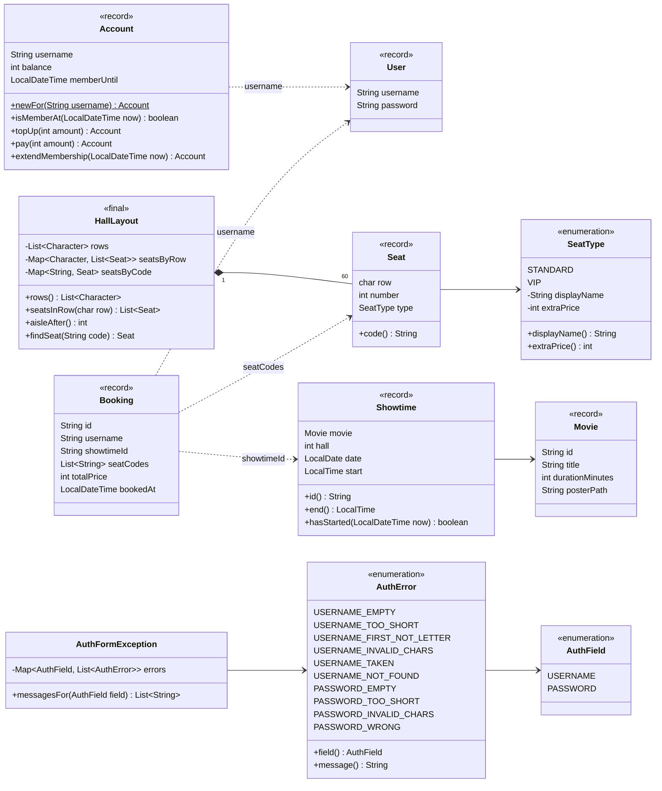
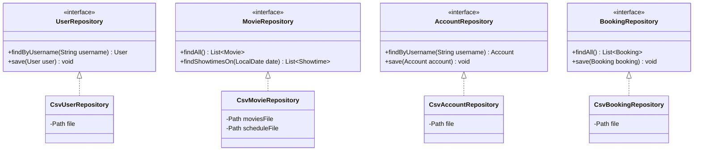
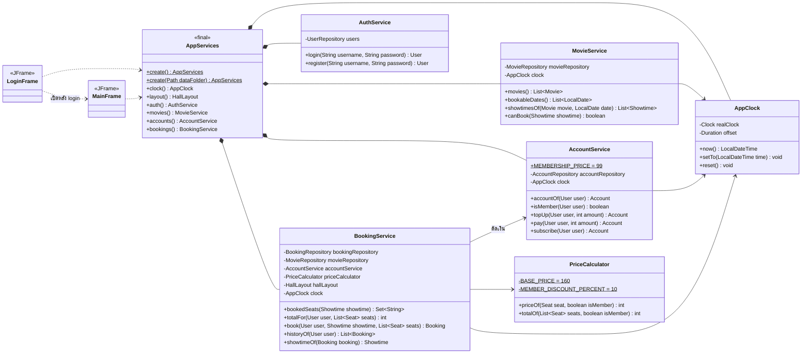

# 🎬 ระบบจองตั๋วหนัง (Movie Ticket Booking)

Mini project วิชา Software Construction — โปรแกรมจองตั๋วหนังแบบหน้าจอ (Java Swing) เก็บข้อมูลในไฟล์ CSV ไม่ใช้ database

- ภาษา: **Java 17** (ใช้ `record` จึงต้อง 17 ขึ้นไป)
- เครื่องมือ: **VS Code** และ **NetBeans**
- ข้อมูล: ไฟล์ CSV ในโฟลเดอร์ `Booking_tickets/data/`

---

## 1. ทำอะไรได้บ้าง

| เรื่อง | กฎ |
|---|---|
| สมัคร / เข้าสู่ระบบ | ชื่อยาวอย่างน้อย 5 ตัว ขึ้นต้นด้วยตัวอักษรอังกฤษ ใช้ได้แค่อังกฤษกับตัวเลข, รหัสยาวอย่างน้อย 5 ตัว อังกฤษกับตัวเลข, ชื่อซ้ำไม่ได้ (ไม่สนตัวพิมพ์เล็ก/ใหญ่) |
| เลือกหนัง / รอบ | จองล่วงหน้าได้ 3 วัน (วันนี้ พรุ่งนี้ มะรืน) มี 3 โรง รอบที่เริ่มฉายแล้วจองไม่ได้ |
| ผังที่นั่ง | โรงละ 6 แถว (A–F) แถวละ 10 ที่ ทางเดินอยู่หลังที่นั่งเลข 5, แถว A–E ธรรมดา แถว F เป็น VIP |
| ราคา | ธรรมดา 160 บาท, VIP 160 + 40 = 200 บาท, สมาชิกลด 10% ทุกที่นั่ง |
| กระเป๋าเงิน | ผู้ใช้ใหม่มี 0 บาท เติมได้ครั้งละ 1–5000 บาท ไม่จำกัดยอดรวม |
| สมาชิก | 99 บาท ต่อ 30 วันเต็ม (นับถึงนาที) ต่ออายุก่อนหมด = ต่อจากวันหมดเดิม |
| จองตั๋ว | เลือกได้กี่ที่ก็ได้ (อย่างน้อย 1) ตัดเงินจากกระเป๋าทันที ที่นั่งที่ถูกจองแล้วจองซ้ำไม่ได้ |
| ยกเลิก | **จ่ายแล้วยกเลิกไม่ได้** (กันการกดยกเลิกวินาทีสุดท้ายจนที่นั่งว่างเปล่า) |
| ประวัติ | ดูการจองของตัวเอง ใหม่สุดอยู่บน |
| ตั้งเวลา (ใช้ตอน demo) | เลื่อนเวลาของโปรแกรมได้ ทุกหน้าจอเห็นเวลาเดียวกัน |

ตัวอย่างราคา: สมาชิกจอง A1 (ธรรมดา) + F7 (VIP) = 144 + 180 = **324 บาท**

---

## 2. วิธีรัน

1. เปิดโฟลเดอร์ `project` (หรือ `Booking_tickets`) ใน VS Code / NetBeans
2. เปิด `Booking_tickets/src/gui/LoginFrame.java` แล้วกด **Run**
3. โปรแกรมหาโฟลเดอร์ `data` เอง ได้ทั้งตอนรันจาก `project` และจาก `Booking_tickets`

รันจาก terminal (PowerShell ใน VS Code) พร้อมเปิด `-ea` ให้ `checkRep()` ทำงาน:

```powershell
cd Booking_tickets
javac -encoding UTF-8 -d out (Get-ChildItem -Recurse src -Filter *.java).FullName
java -ea -cp out gui.LoginFrame
```

> `users.csv`, `accounts.csv`, `bookings.csv` โปรแกรมสร้างเองตอนใช้งานครั้งแรก และไม่ขึ้น GitHub (อยู่ใน `.gitignore`) แต่ละเครื่องจึงมีผู้ใช้ของตัวเอง

---

## 3. โครงสร้างโปรเจกต์

```
project/
├── README.md
├── .gitignore
└── Booking_tickets/
    ├── data/
    │   ├── movies.csv        หนัง 5 เรื่อง
    │   ├── schedule.csv      ตารางฉาย (ใช้ซ้ำทุกวัน)
    │   ├── users.csv         สร้างเองตอนสมัครคนแรก
    │   ├── accounts.csv      สร้างเองตอนเติมเงินครั้งแรก
    │   └── bookings.csv      สร้างเองตอนจองครั้งแรก
    └── src/
        ├── model/            ข้อมูล (ไม่รู้จักไฟล์ ไม่รู้จักหน้าจอ)
        ├── exception/        error ของหน้า Login / Sign up
        ├── repository/       อ่าน/เขียนไฟล์ CSV
        ├── service/          กฎของระบบ + AppServices
        └── gui/              หน้าจอ Swing
```

---

## 4. Class Diagram

### 4.1 ภาพรวม: ใครเรียกใคร



- `model` ไม่รู้จักใครเลย ใช้ได้ทุกชั้น
- `service` รู้จักแค่ **interface** ของ repository ไม่รู้ว่าข้อมูลอยู่ใน CSV
- `AppServices` เป็น**ที่เดียว**ที่ `new Csv...Repository` แล้วส่งเข้า service ทาง constructor (SC5 DIP)
- หน้าจอรับ `AppServices` ตัวเดียวต่อกันไปทุกหน้า จึงใช้นาฬิกา (`AppClock`) ตัวเดียวกันทั้งโปรแกรม
- เส้น gui → `AppServices` เป็นแบบหลัง merge branch `gui` (ตอนนี้หน้าจอยังสร้าง service เอง)

### 4.2 model + exception



| คลาส | หน้าที่ |
|---|---|
| `User` | ชื่อ + รหัส ของคนที่สมัคร |
| `Movie` | หนัง 1 เรื่อง |
| `Showtime` | รอบฉาย 1 รอบ id เช่น `2026-10-01_H1_1000` = วันที่ 1/10 โรง 1 เวลา 10:00 |
| `SeatType` | ประเภทที่นั่ง + ราคาเพิ่ม (VIP +40) |
| `Seat` | ที่นั่ง 1 ที่ เช่น แถว F เลข 7 → `code()` = `F7` |
| `HallLayout` | ผังโรง A–F × 1–10 ทางเดินหลังเลข 5 ใช้วาดปุ่มที่นั่ง |
| `Account` | เงินในกระเป๋า + วันหมดสมาชิก ทุกเมธอดคืน `Account` ตัวใหม่ (ตัวเดิมไม่เปลี่ยน) |
| `Booking` | การจอง 1 ครั้ง ราคารวมที่จ่ายจริง และเวลาจอง |
| `AuthError` / `AuthField` / `AuthFormException` | error ของหน้า Login / Sign up บอกได้ว่าขึ้นใต้ช่องไหน |

### 4.3 repository



| interface | กฎของ `save` / ค่าที่คืน |
|---|---|
| `UserRepository` | `findByUsername` ไม่เจอคืน `null` |
| `MovieRepository` | อ่านอย่างเดียว ตารางฉายเดียวกันใช้ได้ทุกวัน |
| `AccountRepository` | `findByUsername` คืน `null` = สมัครแล้วแต่ยังไม่เคยเติมเงินหรือสมัครสมาชิก, `save` มีแล้วเขียนทับ ไม่มีต่อท้าย |
| `BookingRepository` | `save` ต่อท้ายอย่างเดียว id ซ้ำ → error (จ่ายแล้วแก้ไม่ได้) |

ข้อมูลในไฟล์ผิดรูปแบบ → `IOException` ที่บอกชื่อไฟล์และบรรทัด เช่น `bookings.csv บรรทัด 3: ...`

### 4.4 service + gui



| คลาส | หน้าที่ |
|---|---|
| `AppClock` | นาฬิกาของโปรแกรม เลื่อนเวลาได้ตอน demo |
| `AuthService` | ตรวจกฎ Login / Sign up แล้วบันทึกผู้ใช้ |
| `MovieService` | วันที่จองได้ 3 วัน, รอบของหนังในวันนั้น (เรียงตามเวลา), รอบนี้ยังจองได้ไหม |
| `AccountService` | ดูเงิน, เติมเงิน, จ่ายเงิน, สมัครสมาชิก 99 บาท |
| `PriceCalculator` | ราคาต่อที่นั่งและราคารวม (ส่วนลดสมาชิก 10%) |
| `BookingService` | จองตั๋ว: เช็กตามลำดับ → บันทึก → ตัดเงิน, ที่นั่งที่ถูกจองแล้ว, ประวัติ |
| `AppServices` | สร้างของหลังบ้านทุกตัวครั้งเดียว หาโฟลเดอร์ `data` เอง |

**`BookingService.book` เช็กตามลำดับนี้ ผิดข้อไหนหยุดทันที ไม่บันทึก ไม่ตัดเงิน**

| # | เช็ก | ข้อความบนหน้าจอ |
|---|---|---|
| 1 | รอบเริ่มฉายแล้ว | รอบนี้เริ่มฉายไปแล้ว จองไม่ได้ |
| 2 | ไม่ได้เลือกที่นั่ง | กรุณาเลือกที่นั่งอย่างน้อย 1 ที่ |
| 3 | ที่นั่งไม่มีในผัง (หน้าจอส่งแต่ที่นั่งจากผัง จึงไม่เกิดตอนใช้งานจริง) | no such seat: G3 |
| 4 | เลือกที่นั่งเดิมซ้ำ | เลือกที่นั่ง C5 ซ้ำ |
| 5 | ที่นั่งถูกจองไปแล้ว | ที่นั่ง A1, F7 ถูกจองไปแล้ว |
| 6 | เงินไม่พอ | เงินไม่พอ มี 100 บาท ต้องจ่าย 160 บาท |

**วิธีใช้ในหน้าจอ**

```java
AppServices app = AppServices.create();                 // ครั้งเดียวใน LoginFrame.main

User user = app.auth().login(username, password);       // ปุ่มเข้าสู่ระบบ
app.movies().showtimesOf(movie, date);                  // รอบของหนัง
app.bookings().bookedSeats(showtime);                   // ที่นั่งสีเทา
app.bookings().totalFor(user, chosenSeats);             // ยอดเงินก่อนกดจอง
app.bookings().book(user, showtime, chosenSeats);       // ปุ่มยืนยัน
app.accounts().topUp(user, 500);                        // หน้าเติมเงิน
app.accounts().subscribe(user);                         // ปุ่มสมัครสมาชิก
app.bookings().historyOf(user);                         // หน้าประวัติ
```

---

## 5. รูปแบบไฟล์ CSV (ไม่มีบรรทัดหัวตาราง)

| ไฟล์ | คอลัมน์ | ตัวอย่าง |
|---|---|---|
| `movies.csv` | id, ชื่อ, ความยาว (นาที), รูปโปสเตอร์ | `M1,Spider-Man: Brand New Day,145,posters/m1.png` |
| `schedule.csv` | โรง, เวลาเริ่ม, id หนัง | `1,10:00,M1` |
| `users.csv` | ชื่อ, รหัส | `somchai,abc12345` |
| `accounts.csv` | ชื่อ, เงิน, หมดสมาชิก (ว่าง = ไม่เคยสมัคร) | `somchai,77,2026-10-31T09:30` |
| `bookings.csv` | id, ชื่อ, id รอบ, ที่นั่ง (คั่นด้วย `;`), ราคารวม, เวลาจอง | `B1,somchai,2026-10-01_H1_1000,A1;F7,324,2026-10-01T09:15` |

ชื่อผู้ใช้มี `,` ไม่ได้ (กฎสมัครห้ามอยู่แล้ว และ repository เช็กซ้ำอีกชั้นกันคอลัมน์เลื่อน)

---

## 6. หลัก Software Construction ที่ใช้

| SC | ใช้ตรงไหน |
|---|---|
| SC1 Static checking | ใช้ `enum` (`SeatType`, `AuthError`) และ `record` ให้ compiler จับผิดก่อนรัน |
| SC2 Clean code | ไม่มีตัวเลขลอย (`BASE_PRICE`, `MAX_TOP_UP`, `MEMBERSHIP_DAYS`), input ผิด → `throw`, เงื่อนไขภายใน → `assert` ใน `checkRep()`, JavaDoc ทุกเมธอดของหลังบ้าน |
| SC4 ADT | คลาสใน model / repository / service เขียน AF / RI และตรวจ RI ด้วย `checkRep()` (`User`, `Movie`, `Showtime` ตรวจใน constructor), `List.copyOf` / `Map.copyOf` กัน rep exposure, `Account.topUp` / `pay` / `extendMembership` เป็น producer คืนตัวใหม่ |
| SC5 Mutability / Equality / SOLID | model เป็น immutable ทั้งหมด (`record` และ `final class HallLayout`), enum มี field, service รับ repository เป็น interface ทาง constructor (DIP) แยก service ตามหน้าที่ (SRP) |
| SC7 Concurrency | `AppClock` ถูกใช้ร่วมกันและแก้ค่าได้ จึงใส่ `synchronized` ไว้ก่อน (ตอนนี้ทุกอย่างรันบน thread ของหน้าจอ ถ้าวันหลังมี thread เบื้องหลังไม่ต้องย้อนมาแก้), model immutable แชร์ข้าม thread ได้ปลอดภัย |
| SC8 Collections / Lambda | `List`, `Set`, `Map`, `EnumMap`, `HashSet` เช็กที่นั่งซ้ำ, `Comparator.comparing(showtime -> showtime.start())` เรียงรอบ |

---

## 7. ข้อมูลโครงงาน

- รายวิชา Software Construction
- มหาวิทยาลัยเกษตรศาสตร์ วิทยาเขตกำแพงแสน